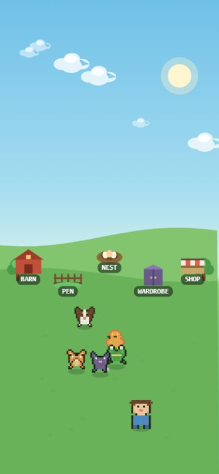
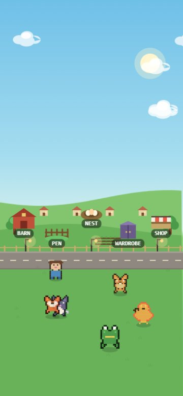
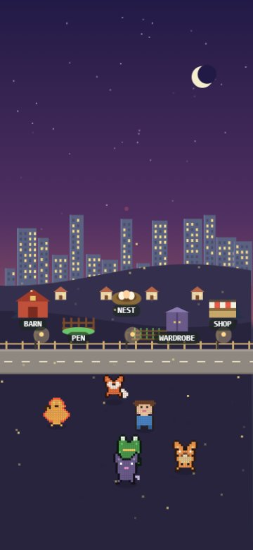
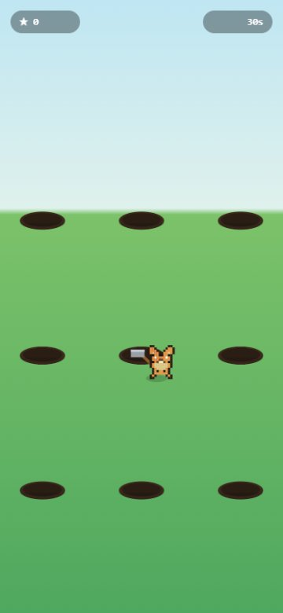
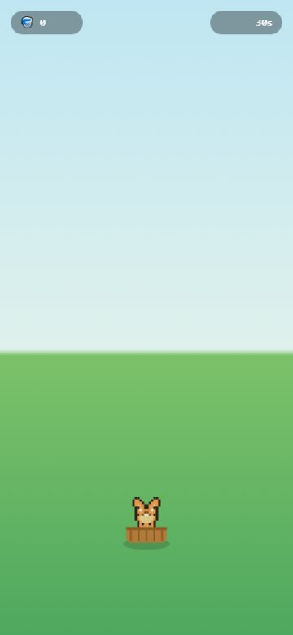
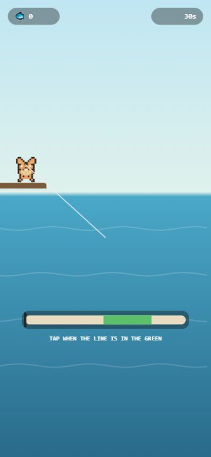
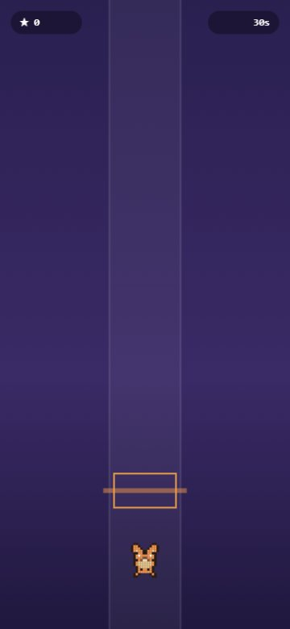

# 🐾 COBBIES — A Cozy Creature Ranch

A mobile-first, portrait, one-thumb creature ranch. Collect 150 pixel critters,
raise them through evolution stages, play five one-thumb minigames, and grow a
calm, warm homestead that slowly fills in around you — from an empty meadow into
a lit-up little city. Tamagotchi-meets-arcade — low-pressure and cozy.

### ▶️ [**Play it live → dadpops.github.io/cobbies**](https://dadpops.github.io/cobbies/)

Runs in any modern browser; best on a phone (add it to your home screen — it's an
installable PWA). Your progress saves automatically in the browser.

---

## Screenshots

Your ranch grows more lived-in as your collection grows — a new tier of scenery
every few cobbies, from a quiet homestead to a glittering skyline:

| Level 1 · Homestead | Level 5 · Village | Level 8 · City Lights |
|:---:|:---:|:---:|
|  |  |  |

Five one-thumb minigames feed XP and coins back into the collection:

| 🔨 Whack-a-Cobbie | 🧺 Catch | 🎣 Fishing | 🎵 Rhythm |
|:---:|:---:|:---:|:---:|
|  |  |  |  |

---

## How to play

The whole game is one gentle loop, and a **guided tutorial** walks you through it
on first launch (tap the **❓** in the top bar to replay it anytime):

1. **Meet your cobbies.** A few critters roam your ranch and greet you by name.
   Tap any one to open its card.
2. **Play for XP + coins.** Tap **▶ PLAY** and pick one of five minigames:
   - 🏃 **Runner** — one-tap jumping; the farther you go, the more you earn.
   - 🔨 **Whack-a-Cobbie** — bonk the pop-ups across three rows for 30 seconds.
   - 🧺 **Catch** — slide your cobbie to catch falling treats and dodge bombs.
   - 🎣 **Fishing** — tap when the sweeping line lands in the green to hook a fish.
   - 🎵 **Rhythm** — tap the notes on the beat-line and build a combo.

   Choose a star cobbie to level up, plus a **cheerleader buddy** who cheers from
   the sideline (the buddy sits out the round, so it can't also star).
3. **Grow & evolve.** XP pushes each cobbie through evolution stages, with a
   dedicated reveal moment when they transform.
4. **Hatch new friends** at the 🥚 **Nest** — a rarity-weighted random egg (with a
   pity timer that guarantees legendaries) or a direct pick. Duplicates bank bonus XP.
5. **Watch your ranch level up.** Every few cobbies collected unlocks a new
   **ranch level** — a paved road, a village, street lamps, and eventually a
   glowing city skyline — plus a bit more ranch space each time.
6. **Put cobbies to work** at the 🚜 **Barn** — station them at the Berry Patch,
   Fishing Hole, or Lookout to earn coins over time, even while you're away.
   Collect the coins and **expand your ranch** to hold more critters.
7. **Spend & customise** — buy **hats** and expansions in the **Shop**, unlock
   **hammer skins** for Whack, dress up your own avatar at the **Wardrobe**, and
   browse everyone you've found in the **Pen**.
8. **Chase goals** — a ⭐ **daily challenge for each minigame** plus long-term goals
   reward coins, hats, hammers, more ranch space, and new **scenes** (biomes).

Collecting all 150 cobbies and maxing out the ranch is paced to take a few weeks
to a couple of months of a short daily session — cozy, not grindy.

## Features

- **150 collectible critters** across common / rare / legendary tiers, each with
  three evolution stages, rarity, and flavor text.
- **Five one-thumb minigames** — endless Runner, Whack-a-Cobbie, Catch, Fishing,
  and Rhythm — that all feed XP and coins back into the collection.
- **8-level ranch progression** — the home scene fills in as you collect: paved
  road, garden plots, cottages, street lamps, townhouses, and a lit-up city
  skyline, each level also granting more ranch capacity.
- **Idle economy** — station critters at jobs for offline coin accrual (capped so
  it stays idle-friendly), then reinvest into ranch capacity.
- **Hatchery** with rarity weighting, pity, and direct buy; dupes convert to XP.
- **4 biomes** — Meadow, Desert, Snowfield, and Dusk — each with its own sky, sun
  or moon and stars, parallax hills, **drifting clouds**, decor, and ambient
  particles (snow / fireflies).
- **Cosmetics** — 7 hats for critters, plus **6 Whack mallet skins** with a
  squeaky bonk, unlocked through whack goals.
- **Avatar creator** — customise your on-ranch character (skin, hair, outfit…).
- **Nora**, your hand-authored guide, plus a weighted home-dialogue voice so
  captured cobbies greet you by name.
- **Goals & dailies** — one daily challenge per minigame, plus a lifetime goals
  ladder that unlocks hats, hammers, capacity, and biomes.
- **Music & SFX** with a settings panel (track, volume, dynamic tempo, mute).
- **Guided tutorial** — a first-launch spotlight walkthrough of every feature,
  reopenable anytime.
- **Persistent save** (localStorage) and an **installable PWA** manifest.

## Running locally

The game uses native ES modules, so it must be served over HTTP (opening
`index.html` via `file://` will fail on module imports). Any static server works:

```bash
npm run dev
# or, without Node:
python -m http.server 8000
```

Then open the printed URL (e.g. http://localhost:8000).

## Project structure

```
index.html            shell + all screen/overlay markup
main.js               orchestrator: state, screen flow, minigame wiring
css/styles.css        all styles
manifest.webmanifest  PWA manifest
data/
  creatures.js        content spine — sprites, palettes, stages, rarity, flavor
  creatures_extra.js  additional hand-authored critter art
  generator.js        procedural sprite-bank generation (scales to 150)
  biomes.js           selectable scenes (sky, hills, clouds, decor, particles)
  cosmetics.js        wearable hats (pixel overlays)
  hammers.js          Whack mallet skins + shared draw helper
  avatar.js           the player-avatar sprite + options
  dialogue.js         companion lines (Nora sets the tone)
render/
  pixel.js            the shared grid+palette pixel renderer
  critter.js          critter drawing (sprite + equipped hat)
systems/
  save.js             localStorage persistence (roster, coins, name, pity, flags)
  hatch.js            egg economy: random roll + pity + direct buy
  farm.js             ranch home scene — buildings, critters, lived-in scenery
  ranch.js            ranch levels — tiers, gating, capacity bonuses
  run.js              one-button endless runner
  whack.js            whack-a-cobbie minigame
  catch.js            catch-the-treats minigame
  fishing.js          timing-bar fishing minigame
  rhythm.js           tap-to-the-beat minigame
  idle.js             station/jobs idle economy + ranch capacity
  quests.js           lifetime goals ladder (hats, hammers, biomes, space)
  daily.js            per-minigame daily challenges
audio/
  music.js            background music tracks
  sfx.js              sound effects (incl. the whack squeak)
ui/
  screens.js          roster select, collection/dex, character card, pickers
  title.js            title / splash screen
  tutorial.js         first-launch how-to-play walkthrough
  settings.js         music / sound settings panel
scripts/
  gen-icons.mjs       icon/asset generation
```

## Roadmap note on TypeScript

Modules are plain JS with JSDoc types today. Migrating to TypeScript + Vite
later is mostly mechanical: add `tsconfig`, rename `.js`→`.ts`, and the JSDoc
shapes (`GameState`, `OwnedCreature`, `HatchResult`) become real interfaces.

See [`cobbiesdraft.md`](cobbiesdraft.md) for the original product brief.
